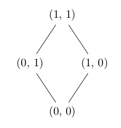
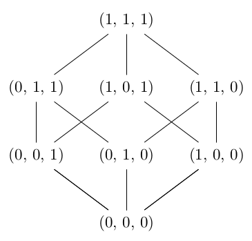

# Required modules

This project does not have any required modules.

# Examples

The script `draw_lattice_2.py` generates the LaTeX code for the following lattice:

The script `draw_lattice_3.py` generates the LaTeX code for the following lattice:

